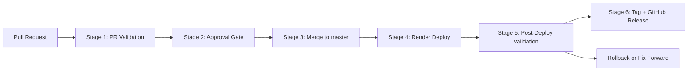

# Zip Procurement Intake QA Take-Home

Live application:

- [zip-procurement-quality-gates.onrender.com](https://zip-procurement-quality-gates.onrender.com)

This repository is a small procurement intake application wrapped in a deliberate QA and release process. A user submits a purchase request, the system evaluates the request, and the UI shows which teams need to approve it based on spend, contract review, and data handling. The app itself is intentionally small; the main focus of the exercise is the delivery pipeline, governance model, and release confidence.

## What this repo demonstrates

- A small full-stack TypeScript application aligned to Zip's procurement workflow domain
- A layered automated testing strategy across unit, integration, and end-to-end coverage
- Pull request quality gates with branch protection, approvals, and status checks
- Security and quality checks in GitHub Actions
- A real deployment path using Render
- A lightweight release process with post-deploy validation, tagging, and GitHub Releases
- Bonus release-engineering artifacts for local Docker and blue/green rollout simulation

## Application overview

The product flow models a lightweight procurement intake request:

- an employee submits a purchase request
- the API evaluates the request
- the UI shows the approval path and risk level
- routing logic reflects spend, contract review, and customer-data handling

Example approval logic:

- high spend triggers Finance
- contract review triggers Legal
- customer data triggers Security
- low-risk requests stay with Manager approval only

## Architecture

See the full architecture notes in [docs/architecture.md](docs/architecture.md).

High-level components:

- `apps/web`: React + Vite frontend
- `apps/api`: Express API
- `packages/domain`: shared procurement business rules
- `.github/workflows`: CI, security, deployment-smoke, nightly, release, and PR-governance workflows
- `docs`: process, architecture, ownership, blue/green, reporting, and release documentation

## Testing strategy

This repo uses a small but explicit test pyramid:

- Unit tests validate procurement business rules in [`packages/domain/src/index.ts`](packages/domain/src/index.ts)
- API integration tests validate routing and health behavior in [`apps/api/src/app.ts`](apps/api/src/app.ts)
- UI integration tests validate form behavior in [`apps/web/src/App.tsx`](apps/web/src/App.tsx)
- Playwright smoke tests validate critical browser journeys in [`apps/web/tests/e2e/procurement-flow.spec.ts`](apps/web/tests/e2e/procurement-flow.spec.ts)

## Local setup

```bash
npm install
npm run dev
```

Local URLs:

- Frontend: `http://localhost:5173`
- API: `http://localhost:3001`

## Local quality checks

```bash
npm run lint
npm run typecheck
npm run test:unit
npm run test:integration
npm run coverage
npm run test:e2e
npm run security:audit
```

## CI and governance

The primary CI workflow is [`ci.yml`](.github/workflows/ci.yml). It runs on:

- every pull request
- every push to `master`

The CI pipeline is intentionally organized into a small set of clear quality stages:

- `Quality Core`
  - lint
  - typecheck
  - unit tests
  - API integration tests
  - web integration tests
  - coverage
- `E2E Smoke Tests`
- `Quality Gate`

Additional quality and security workflows include:

- [`codeql.yml`](.github/workflows/codeql.yml)
- [`security-audit.yml`](.github/workflows/security-audit.yml)
- [`gitleaks.yml`](.github/workflows/gitleaks.yml)
- [`nightly-regression.yml`](.github/workflows/nightly-regression.yml)
- [`deploy-smoke.yml`](.github/workflows/deploy-smoke.yml)
- [`release.yml`](.github/workflows/release.yml)
- [`pr-governance.yml`](.github/workflows/pr-governance.yml)

Branch governance is designed around `master`:

- pull request required before merge
- 1 approval required
- stale approvals dismissed on new commits
- force pushes blocked
- deletions restricted
- linear history required
- squash and rebase merges allowed
- merge commits disabled

This sample repository uses `master` as the default branch to match the wording of the take-home assignment.

PR process artifacts:

- [`CODEOWNERS`](CODEOWNERS)
- [PR template](.github/pull_request_template.md)
- [Issue templates](.github/ISSUE_TEMPLATE)

Detailed rollout notes are in [docs/process.md](docs/process.md).
Detailed review expectations are in [docs/review-guidelines.md](docs/review-guidelines.md).

## PR quality rules

The PR template and governance workflow enforce a more deliberate review process:

- branch name must follow a format such as `feature/change-name`
- PR title must follow a format such as `QA-1234: concise summary`
- PR body must include required sections for summary, validation, checklist, and risk review
- ticket references are required in the PR content

## Render deployment

This repo includes a Render Blueprint in [`render.yaml`](render.yaml). The deployed service uses one Node web service:

- Vite builds the frontend
- Express serves the built frontend
- the same service exposes `/api/health` and the browser app

Deployment steps:

1. In Render, create a new `Blueprint`
2. Connect the GitHub repository
3. Point the Blueprint at `master`
4. Render reads [`render.yaml`](render.yaml) and creates the service
5. Render auto-deploys only after checks pass on the tracked branch

Live service URL:

- [zip-procurement-quality-gates.onrender.com](https://zip-procurement-quality-gates.onrender.com)

## Deployment and release pipeline



Stage details:

1. `PR Validation`
   Governance, CI, and security checks run on the PR.
2. `Approval Gate`
   Branch protection requires approval and passing required checks.
3. `Merge to master`
   Approved PRs merge to the protected branch.
4. `Render Deploy`
   Render deploys the merged commit from `master`.
5. `Post-Deploy Validation`
   The live root URL, `/api/health`, and deployed smoke tests validate the running application.
6. `Tag + GitHub Release`
   The manual release workflow creates a semantic version tag and publishes a GitHub Release after validation passes.

This keeps deployment automatic but release marking intentional.

## Release metadata

The deployed service reports lightweight release metadata from `/api/health`:

```json
{
  "status": "ok",
  "version": "v1.0.0",
  "commitSha": "<sha>"
}
```

This makes it easier to confirm what version is deployed during validation and release promotion.

## Local Docker and blue/green support

The primary hosted deployment path for this take-home uses Render. Docker and blue/green assets are included as local release-engineering demonstrations:

- [`docker-compose.blue-green.yml`](docker-compose.blue-green.yml)
- [`docs/blue-green.md`](docs/blue-green.md)
- [`scripts/switch-active-color.sh`](scripts/switch-active-color.sh)

These assets model:

- dual-color rollout preparation
- health-based traffic switching
- rollback thinking
- future-state environment portability

## Operating model and reporting

Supporting process docs are available in:

- [Take-home summary](docs/take-home-summary.md)
- [Architecture](docs/architecture.md)
- [Process](docs/process.md)
- [Review guidelines](docs/review-guidelines.md)
- [Ownership](docs/ownership.md)
- [Triage and communications](docs/triage-and-comms.md)
- [Weekly quality report](docs/weekly-quality-report.md)
- [Bug scoring](docs/bug-scoring.md)

## Should there be Codex or skills docs?

No additional Codex-specific or skills-specific documentation is needed for the take-home submission. Those are assistant tooling details, not part of the product, CI/CD, or QA process the reviewer is evaluating. The stronger submission is the one that stays focused on:

- application behavior
- test strategy
- CI/CD controls
- deployment and release process
- stakeholder communication
