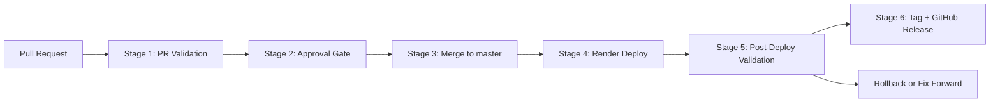

# Zip Procurement Intake QA Take-Home

This repository is a small procurement intake application with a QA-focused delivery setup around it. A user submits a purchase request, the system evaluates the request, and the UI shows which teams need to approve it based on spend, contract review, and data handling.

## Scope

- React + Vite frontend for procurement intake
- Express API for evaluation logic
- Shared TypeScript domain rules for validation and approval routing
- Unit, integration, and end-to-end coverage
- GitHub Actions CI for pull requests and `master`
- Plain text and CSS UI with no icon library or generated visual assets

## Testing strategy

- Unit tests validate procurement business rules in [`packages/domain/src/index.ts`](/Users/somu-cookunity/Documents/zip/packages/domain/src/index.ts)
- API integration tests validate request handling in [`apps/api/src/app.ts`](/Users/somu-cookunity/Documents/zip/apps/api/src/app.ts)
- UI integration tests validate form behavior in [`apps/web/src/App.tsx`](/Users/somu-cookunity/Documents/zip/apps/web/src/App.tsx)
- Playwright smoke tests validate critical browser journeys in [`apps/web/tests/e2e/procurement-flow.spec.ts`](/Users/somu-cookunity/Documents/zip/apps/web/tests/e2e/procurement-flow.spec.ts)

## Local setup

```bash
npm install
npm run dev
```

Frontend: `http://localhost:5173`

API: `http://localhost:3001`

## Local quality checks

```bash
npm run lint
npm run typecheck
npm run test:unit
npm run test:integration
npm run coverage
npm run test:e2e
npm run security:audit
```

## CI coverage

The GitHub Actions workflow in [`.github/workflows/ci.yml`](/Users/somu-cookunity/Documents/zip/.github/workflows/ci.yml) runs on every pull request and on pushes to `master`.

Phase 2 quality gates also include:

- TypeScript typechecking
- Vitest coverage collection
- npm dependency audit
- CodeQL static analysis in [`.github/workflows/codeql.yml`](/Users/somu-cookunity/Documents/zip/.github/workflows/codeql.yml)
- scheduled security audit in [`.github/workflows/security-audit.yml`](/Users/somu-cookunity/Documents/zip/.github/workflows/security-audit.yml)

Phase 3 operational additions include:

- nightly regression in [`.github/workflows/nightly-regression.yml`](/Users/somu-cookunity/Documents/zip/.github/workflows/nightly-regression.yml)
- deploy smoke validation in [`.github/workflows/deploy-smoke.yml`](/Users/somu-cookunity/Documents/zip/.github/workflows/deploy-smoke.yml)
- secret scanning in [`.github/workflows/gitleaks.yml`](/Users/somu-cookunity/Documents/zip/.github/workflows/gitleaks.yml)
- issue templates for bugs, flaky tests, and non-sensitive security findings
- local blue/green deployment assets in [`docker-compose.blue-green.yml`](/Users/somu-cookunity/Documents/zip/docker-compose.blue-green.yml)

## Branch governance

This repo includes the CI workflow, a PR template, and a `CODEOWNERS` file. After pushing to GitHub, configure branch protection on `master` to:

- require the CI check to pass
- require 1 approval
- dismiss stale approvals on new commits
- block direct pushes
- allow squash and rebase merges only

Detailed rollout notes are in [`docs/process.md`](/Users/somu-cookunity/Documents/zip/docs/process.md).

## Render deployment

This repo includes a [`render.yaml`](/Users/somu-cookunity/Documents/zip-code/render.yaml) blueprint for a single Render web service. The service builds the Vite frontend, serves it from the Express app, and exposes the API and UI from one URL.

To deploy:

1. In Render, click `New +` -> `Blueprint`.
2. Connect the GitHub repo and select the `master` branch.
3. Render will detect [`render.yaml`](/Users/somu-cookunity/Documents/zip-code/render.yaml) and create one Node web service.
4. After the first deploy, use the service's `onrender.com` URL for the manual deploy smoke workflow in [`.github/workflows/deploy-smoke.yml`](/Users/somu-cookunity/Documents/zip-code/.github/workflows/deploy-smoke.yml).

The blueprint uses `autoDeployTrigger: checksPass`, so Render deploys only after GitHub checks pass on the linked branch.

## Deployment and release pipeline



Stage details:

1. `PR Validation`
   Runs linting, typechecking, unit tests, integration tests, E2E smoke tests, coverage, and security checks.
2. `Approval Gate`
   Requires one review approval and passing required checks before merge.
3. `Merge to master`
   Uses squash or rebase only.
4. `Render Deploy`
   Render auto-deploys the merged commit from `master`.
5. `Post-Deploy Validation`
   Validates the live root URL, `/api/health`, and deployed Playwright smoke tests.
6. `Tag + GitHub Release`
   Runs [`.github/workflows/release.yml`](/Users/somu-cookunity/Documents/zip-code/.github/workflows/release.yml) to create a semantic version tag such as `v1.0.0` and publish a GitHub Release.

This keeps deployment automatic but release marking intentional.

## Local blue/green rollout

The repository includes a Docker-based blue/green demo for local release validation. Setup notes are in [`docs/blue-green.md`](/Users/somu-cookunity/Documents/zip/docs/blue-green.md).

The Gitleaks workflow is ready for personal repositories as-is. If you run this repo under a GitHub organization, add a `GITLEAKS_LICENSE` secret per the action's requirements.

## Operating model

Operational governance and reporting assets are available in:

- [`docs/ownership.md`](/Users/somu-cookunity/Documents/zip/docs/ownership.md)
- [`docs/triage-and-comms.md`](/Users/somu-cookunity/Documents/zip/docs/triage-and-comms.md)
- [`docs/weekly-quality-report.md`](/Users/somu-cookunity/Documents/zip/docs/weekly-quality-report.md)
- [`docs/bug-scoring.md`](/Users/somu-cookunity/Documents/zip/docs/bug-scoring.md)
