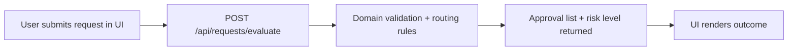
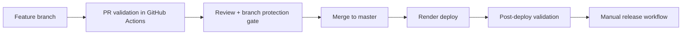

# Architecture Overview

## Purpose

This repository is intentionally small at the product layer and richer at the delivery layer. The goal is to show how a Zip-aligned procurement workflow can be supported by deliberate quality gates, deployment validation, and release governance.

## System components

### Frontend

- Path: [`apps/web`](../apps/web)
- Stack: React + Vite + TypeScript
- Responsibility:
  - collect procurement request input
  - submit requests to the API
  - render approval path and risk result
  - display lightweight release metadata

### API

- Path: [`apps/api`](../apps/api)
- Stack: Express + TypeScript
- Responsibility:
  - expose health and evaluation endpoints
  - serve built frontend assets in the hosted deployment path
  - return release metadata for deployment validation

### Domain package

- Path: [`packages/domain`](../packages/domain)
- Responsibility:
  - validation rules
  - approval routing rules
  - risk classification logic
  - shared request and result types

## Application flow

## Delivery flow

## Testing layers

### Unit

- Domain logic only
- fast validation of approval and risk rules

### Integration

- API request/response behavior
- UI form behavior and state transitions

### End-to-end

- browser-level smoke coverage against local and deployed environments

## Deployment model

The production-style hosted path uses Render:

- one Node web service
- frontend built during deploy
- Express serves the built frontend
- API and UI live behind one URL

The repo also includes local Docker and blue/green assets to demonstrate rollout and rollback thinking, but those are supporting artifacts rather than the main hosted deployment path.
