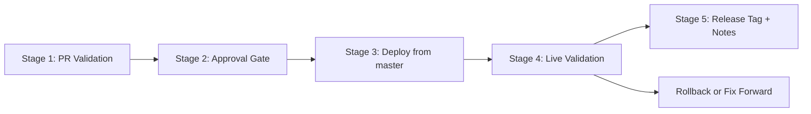

# Delivery Process

## Goal

This take-home shows how a small procurement workflow can be shipped with clear quality gates around it. The goal is to pair a simple product flow with practical testing, CI, and pull request governance.

## SDLC framing

1. Define the procurement workflow and approval rules.
2. Implement business logic in a shared domain package.
3. Expose the logic through an API.
4. Build a UI that captures procurement intake data.
5. Validate behavior with unit, integration, and E2E tests.
6. Enforce the same checks on pull requests and on `master`.
7. Protect merges with reviews and branch rules.

## Required GitHub settings

These settings cannot be fully enforced from the repository alone and should be configured in GitHub after the repo is pushed.

### Branch protection

Apply a branch protection rule to `master` with:

- Require a pull request before merging
- Require at least 1 approval
- Dismiss stale approvals when new commits are pushed
- Require status checks to pass before merging
- Select the `quality` workflow job as the required status check
- Restrict direct pushes to `master`

### Merge policy

Repository merge settings should be:

- Allow squash merge
- Allow rebase merge
- Disable merge commits

This satisfies the assignment requirement to require squash and rebase style merges while preventing merge commits.

## CI behavior

The workflow in [`ci.yml`](../.github/workflows/ci.yml) runs on:

- every pull request
- every push to `master`

Checks performed:

- ESLint
- TypeScript typecheck
- unit tests for domain logic
- API integration tests
- UI integration tests
- coverage reporting
- Playwright smoke E2E tests
- dependency audit
- CodeQL static analysis

## Failure modes

Ways this process can fail include:

- Dependency install failure because of lockfile drift or registry issues
- Typecheck failures caused by schema or interface drift
- Lint failures caused by coding standard regressions
- Unit test failures caused by approval-routing logic regressions
- API integration failures caused by contract or request-shape changes
- UI integration failures caused by broken form wiring
- E2E failures caused by user-flow regressions or flaky selectors
- Dependency audit failures caused by vulnerable packages
- CodeQL findings caused by unsafe patterns or insecure code paths
- GitHub branch protection drift if required checks are renamed
- Missing or stale CODEOWNERS ownership
- Review bottlenecks if approvers are unavailable

## Notifications and visibility

GitHub will notify:

- Pull request authors when checks fail
- Reviewers when approval is requested
- Subscribers/watchers based on their GitHub notification preferences

The workflow also uploads Playwright artifacts on failure, which helps engineers and QA inspect traces and debug quickly in GitHub Actions.

Scheduled security workflows also create recurring visibility:

- weekly CodeQL scans for static analysis drift
- weekly dependency audits for package vulnerability drift
- weekly Gitleaks scans for secret leakage drift

## Stakeholders

As this process evolves, the key stakeholders are:

- Product engineers who own feature delivery
- QA or quality engineering who own coverage strategy
- Engineering managers who own merge policy and team workflow
- Platform or DevOps partners who may help with CI scale and secrets
- Security, legal, and finance partners when approval-routing policy changes

Operational ownership, reporting, and communication templates are documented in:

- [`ownership.md`](./ownership.md)
- [`triage-and-comms.md`](./triage-and-comms.md)
- [`weekly-quality-report.md`](./weekly-quality-report.md)
- [`bug-scoring.md`](./bug-scoring.md)

## Phase 3 rollout maturity

Phase 3 extends the project beyond CI into release confidence and operational safety:

- nightly regression to catch drift outside the PR path
- deploy-smoke workflow that can validate a hosted preview or release URL
- release workflow that validates production and creates a Git tag plus GitHub Release
- secret scanning for accidental credential exposure
- issue templates for bug intake and flaky-test triage
- local blue/green deployment to model traffic switching and rollback

## Deployment validation

The deploy-smoke workflow can be triggered manually with a target URL. It reuses the Playwright smoke suite against a deployed environment instead of the local dev server. This is intended for:

- preview environments
- staging validation
- post-release smoke checks

## Release process

This repo treats release as staged promotion rather than one long script.

Stage summary:

1. `PR Validation`
   Lint, typecheck, unit tests, integration tests, E2E smoke, coverage, and security checks run on the pull request.
2. `Approval Gate`
   Branch protection requires a reviewer approval and passing checks before merge.
3. `Deploy from master`
   Render automatically deploys the merged commit from `master`.
4. `Live Validation`
   The deployed root URL, `/api/health`, and deployed smoke tests are validated against the live service.
5. `Release Tag + Notes`
   [`.github/workflows/release.yml`](../.github/workflows/release.yml) creates a semantic version tag and a GitHub Release only after live validation passes.

The `/api/health` endpoint includes release metadata so the deployed service can report its current version during validation.

## Blue/green mechanism

The blue/green assets in [`docker-compose.blue-green.yml`](../docker-compose.blue-green.yml) model a local release pattern where:

1. blue and green stacks exist at the same time
2. an edge proxy points traffic to the active stack
3. the inactive stack can be updated and validated
4. traffic flips only after validation succeeds
5. rollback is a fast switch back to the previous color

## Recommended future evolution

- Add contract tests for API payload changes
- Add nightly broader E2E regression coverage
- Add deployment preview environments for richer PR validation
- Add Slack alerts for broken `master` branch quality gates
- Add secret scanning and PII detection for stronger security guardrails
