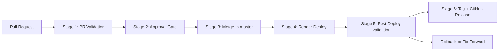

# Delivery Process

## Purpose

This repository is intentionally small at the product layer and more deliberate at the delivery layer. The goal is to show how a procurement workflow can be built, reviewed, tested, deployed, and released with clear quality controls.

The process is designed to do four things well:

- keep `master` releasable
- give engineers fast feedback before merge
- make ownership and review expectations explicit
- create a repeatable path from pull request to validated release

## Operating principles

- every change should be reviewable, testable, and reversible
- the pull request is the main quality gate, not the first place issues are discovered
- `master` should reflect code that is safe to deploy
- automation should reduce manual toil, not hide risk
- release promotion should happen only after live validation succeeds

## Delivery lifecycle

At a high level, the workflow is:

1. Define the procurement workflow and approval rules.
2. Implement the behavior in the shared domain, API, and UI layers.
3. Validate the behavior with unit, integration, and end-to-end tests.
4. Open a pull request and run governance, CI, and security checks.
5. Collect review feedback and approvals.
6. Merge to `master` using the protected merge policy.
7. Deploy from `master`.
8. Validate the live environment.
9. Mark the release only after live validation succeeds.

For the day-to-day working agreement around PR readiness, review communication, SLA, merge expectations, and conflict handling, see [`review-guidelines.md`](./review-guidelines.md).

## Required GitHub protections

These settings cannot be fully enforced from the repository alone and should be configured in GitHub after the repo is pushed.

### Branch protection for `master`

- require a pull request before merging
- require at least 1 approval
- dismiss stale approvals when new commits are pushed
- require conversation resolution before merging
- require status checks to pass before merging
- block force pushes
- restrict branch deletion
- require linear history

The primary required summary gate should be:

- `CI / Quality Gate (pull_request)`

Additional required checks may include:

- `PR Governance`
- `CodeQL / analyze (javascript-typescript) (pull_request)`
- `Security Audit / dependency-audit (pull_request)`
- `Gitleaks / scan (pull_request)`

### Merge policy

Repository merge settings should be:

- allow squash merge
- allow rebase merge
- disable merge commits

This satisfies the assignment requirement to allow squash and rebase style merges while preventing merge commits.

## CI, governance, and security behavior

The repository uses GitHub Actions as the CI platform.

### Core CI workflow

[`ci.yml`](../.github/workflows/ci.yml) runs on:

- every pull request
- every push to `master`

It is intentionally organized into a small set of clear stages:

- `Quality Core`
  - lint
  - typecheck
  - unit tests
  - API integration tests
  - web integration tests
  - coverage
- `E2E Smoke Tests`
  - Playwright browser smoke validation
- `Quality Gate`
  - final summary gate that fails if any required quality stage fails

### Additional workflows

Separate workflows also run for governance and security:

- [`pr-governance.yml`](../.github/workflows/pr-governance.yml)
- [`codeql.yml`](../.github/workflows/codeql.yml)
- [`security-audit.yml`](../.github/workflows/security-audit.yml)
- [`gitleaks.yml`](../.github/workflows/gitleaks.yml)
- [`nightly-regression.yml`](../.github/workflows/nightly-regression.yml)
- [`deploy-smoke.yml`](../.github/workflows/deploy-smoke.yml)
- [`release.yml`](../.github/workflows/release.yml)

This keeps the core CI path readable while still enforcing governance, security, deployment, and release expectations.

## Failure modes

This process can fail in several ways.

### Pull request and governance failures

- branch name does not match the required format
- PR title does not include a valid ticket reference
- PR body is missing required sections
- required reviewer approval is not obtained
- unresolved review conversations block merge
- CODEOWNERS or reviewer routing is outdated

### CI and test failures

- dependency installation fails because of lockfile drift
- lint or typecheck fails because of code changes or interface drift
- unit tests fail because domain rules changed unexpectedly
- API integration tests fail because request or response behavior changed
- UI integration tests fail because the form flow or rendering broke
- E2E smoke tests fail because the main user path regressed
- coverage fails because new code paths are not exercised

### Security failures

- dependency audit detects vulnerable packages
- CodeQL detects unsafe implementation patterns
- Gitleaks detects a committed secret or credential
- workflow or deployment changes create a governance gap

### Deployment and release failures

- Render build fails
- the service starts but the app is not served correctly
- `/api/health` fails or returns unexpected metadata
- deploy-smoke or release-smoke tests fail against the live service
- a release tag already exists or uses the wrong version format

### Process failures

- required checks are renamed but branch protection is not updated
- review requests are delayed beyond SLA
- broken `master` is not triaged quickly
- flaky tests erode trust in the quality gates
- ownership is unclear during an incident

### Practical remediation patterns

| Failure mode | Enterprise impact | Practical response | Long-term control |
| --- | --- | --- | --- |
| False positives in scans or review automation | Teams stop trusting warnings and start ignoring real issues | Require every finding to be triaged as real issue, accepted risk, or false positive | Suppression rules, severity thresholds, and a named owner for scan triage |
| Flaky tests | Red builds lose meaning and real regressions get hidden inside noise | Retry once, track repeat offenders, and file explicit follow-up instead of silently rerunning forever | Flaky-test quarantine, reliability metrics, and suite ownership |
| Environment mismatch after merge | PR checks pass but the deployed system fails because runtime assumptions differ | Validate the live root URL, `/api/health`, and deployed smoke flow before release | Preview environments, config validation, and stronger runtime parity |
| Review SLA bottleneck | Delivery slows because one reviewer or team becomes the critical path | Escalate in the PR channel and rebalance review ownership after SLA breach | Review load balancing, reviewer auto-routing, and latency reporting |
| Security scans without operational ownership | Findings accumulate, and serious issues blend into background noise | Assign a triage owner, define severity, and require explicit disposition for each finding | SonarQube or similar can expand visibility, but ownership, SLA, and remediation policy are the real controls |
| Protected `master` but weak release process | Release notes, tags, and deployed code drift apart, making incidents harder to manage | Validate the live service before tagging and publishing a release | Release approvals, deployment metadata, and version-to-artifact verification |
| Merge conflict resolution introduces unreviewed risk | The final merged code differs from what reviewers actually approved | Rebase on latest `master`, rerun validation, and request re-review when risky files changed | Require explicit re-review for workflow, deployment, and domain-logic conflict resolution |

## Notifications and visibility

### Current notification model

The current implementation relies primarily on GitHub-native visibility:

- PR authors are notified in GitHub when checks fail
- requested reviewers are notified in GitHub when review is needed
- branch protection communicates merge blockers directly in the PR
- workflow failures are visible in GitHub Actions
- CodeQL findings appear in GitHub Security and code scanning

### Debugging artifacts

The workflows also publish useful diagnostics:

- Playwright traces and reports for failed E2E runs
- coverage artifacts from CI
- workflow logs for governance, release, and security failures

### Recommended next-step notifications

As the process matures, I would add:

- Slack alerts for broken `master`
- Slack alerts for failed release validation
- Slack escalation for high-severity security findings
- a weekly quality summary for engineering leadership

## Stakeholders

This process starts with engineering, but it becomes broader as the workflow matures.

### Core stakeholders

- product engineers who build and review features
- QA or quality engineering who own test strategy and pipeline quality
- engineering managers who own team workflow and review expectations
- platform or DevOps partners who own CI/CD plumbing, secrets, and deployment controls

### Extended stakeholders

- security partners when static analysis, secrets, or package risk changes
- legal and finance stakeholders when procurement approval logic evolves
- product stakeholders when release timing or workflow behavior impacts users
- release or incident owners when production validation fails

Operational ownership, reporting, and communication templates are documented in:

- [`review-guidelines.md`](./review-guidelines.md)
- [`ownership.md`](./ownership.md)
- [`triage-and-comms.md`](./triage-and-comms.md)
- [`weekly-quality-report.md`](./weekly-quality-report.md)
- [`bug-scoring.md`](./bug-scoring.md)

## Deployment validation

The deploy-smoke workflow can be triggered manually with a target URL. It reuses the Playwright smoke suite against a deployed environment instead of the local dev server.

This is intended for:

- preview validation
- staging validation
- post-release smoke checks
- manual production confidence checks when needed

## Release process

This repository treats release as staged promotion rather than one long script.

### Stage summary

1. `PR Validation`
   Governance, CI, and security checks run on the pull request.
2. `Approval Gate`
   Required approvals and conversation resolution protect the merge.
3. `Merge to master`
   Approved changes merge into the protected branch.
4. `Render Deploy`
   Render deploys the merged commit from `master`.
5. `Post-Deploy Validation`
   The root URL, `/api/health`, and deployed smoke tests validate the live service.
6. `Tag + GitHub Release`
   [`.github/workflows/release.yml`](../.github/workflows/release.yml) creates a semantic version tag and GitHub Release only after live validation succeeds.

The `/api/health` endpoint includes release metadata so the deployed service can report its current version during validation.

## Local blue/green simulation

The blue/green assets in [`docker-compose.blue-green.yml`](../docker-compose.blue-green.yml) model a local rollout pattern where:

1. blue and green stacks exist at the same time
2. an edge proxy points traffic to the active stack
3. the inactive stack can be updated and validated
4. traffic flips only after validation succeeds
5. rollback is a quick switch back to the previous color

This is a local release-engineering simulation, not the primary hosted deployment path for this submission.

## Recommended future evolution

- add contract tests for API payload changes
- add broader nightly regression coverage
- add preview environments for PR validation
- add stronger reviewer auto-routing by file ownership
- add flaky-test quarantine and tracking
- add Slack alerts for broken `master`
- add stricter release approval for infrastructure or security-sensitive changes
