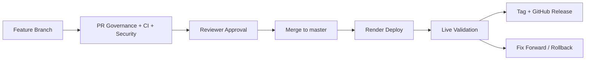

# QA Automation And Delivery Summary

## Scope

This submission combines a small procurement intake application with a deliberate delivery system around it. The product itself is intentionally compact; the main focus is how changes are reviewed, validated, deployed, and released.

Live application:

- [zip-procurement-quality-gates.onrender.com](https://zip-procurement-quality-gates.onrender.com)

Repository:

- [suryasomasundar/zip-procurement-quality-gates](https://github.com/suryasomasundar/zip-procurement-quality-gates)

## What was built

| Area | Implementation |
| --- | --- |
| Product | React + Express procurement intake flow |
| Shared logic | Domain package for routing and risk rules |
| Testing | Unit, API integration, UI integration, Playwright smoke |
| CI | GitHub Actions on PRs and `master` |
| Governance | PR template, PR governance workflow, CODEOWNERS, required approvals |
| Security | CodeQL, dependency audit, Gitleaks |
| Deployment | Render Blueprint and live hosted service |
| Release | Manual release workflow with live validation, tagging, and GitHub Release |
| Bonus | Local Docker + blue/green rollout simulation |

## Delivery flow

## Pull request controls

| Control | Current rule |
| --- | --- |
| Branch naming | `feature/<change>`, `fix/<change>`, `docs/<change>`, etc. |
| PR title | `QA-1234: concise summary` |
| PR body | required summary, validation, checklist, and risk sections |
| Required approval | 1 reviewer |
| Merge methods | squash or rebase only |
| Merge commits | disabled |
| Conversation resolution | required |
| Required status gate | `CI / Quality Gate (pull_request)` |

## CI and security checks

| Workflow | Purpose |
| --- | --- |
| `CI / Quality Core` | lint, typecheck, unit, API integration, web integration, coverage |
| `CI / E2E Smoke Tests` | browser smoke validation |
| `CI / Quality Gate` | final summary gate for branch protection |
| `PR Governance` | branch name, PR title, PR body validation |
| `CodeQL` | static analysis |
| `Security Audit` | dependency vulnerability scan |
| `Gitleaks` | secret scanning |

## PR readiness checklist

Use this as the final “ready for review” standard.

| Check | Expected |
| --- | --- |
| Ticket linked | PR title and body include valid ticket reference |
| Scope clear | PR explains what changed and why |
| Validation listed | local and CI validation called out clearly |
| Risk noted | product, deployment, or workflow risk identified |
| Reviewers tagged | correct owners requested based on change area |
| Screenshots included | when the UI changed |
| Checks green | or clearly in progress with no known unowned failures |
| Docs updated | when workflow, release, or deployment behavior changed |

## Failure modes

| Category | Example failures |
| --- | --- |
| Governance | bad branch name, invalid PR title, missing PR sections |
| CI | lint/typecheck failures, missing coverage, broken tests |
| Security | vulnerable dependency, CodeQL finding, leaked secret |
| Deployment | Render build failure, startup failure, broken frontend serving |
| Release | invalid tag, live smoke failure, health endpoint mismatch |
| Process | stale branch protection, slow review response, unclear ownership |

## Notifications and communication

| Signal | Current location | Future improvement |
| --- | --- | --- |
| PR failures | GitHub PR + Actions | Slack `#team-prs` alert |
| Review requests | GitHub notifications | Slack ready-for-review post |
| Security findings | GitHub Security / Actions | Slack escalation for high severity |
| Broken `master` | GitHub Actions | Slack engineering alert |
| Release failures | GitHub Actions | Slack release alert |

## AI-assisted review

AI-assisted review is treated as an optional advisory signal, not a merge authority.

| Use | Position in the process |
| --- | --- |
| Missing tests | early signal during PR review |
| Workflow drift | advisory check for CI/CD or branch-protection changes |
| Release or infra risk | extra review signal for deployment and release changes |
| Security or configuration concerns | additional context to investigate, not an automatic blocker |

Any actionable AI finding should be confirmed by a human reviewer and then either fixed or explicitly addressed in the PR conversation.

## Stakeholders

| Stakeholder | Role in the process |
| --- | --- |
| Engineers | implement changes, respond to CI failures, review code |
| QA / quality engineering | own test strategy, coverage, and quality gates |
| Engineering managers | enforce workflow expectations and review SLA |
| Platform / infrastructure | own CI/CD plumbing, deployment, secrets, and release flow |
| Security | advise on vulnerabilities, secret findings, and risky workflow changes |
| Product / business partners | validate procurement workflow and approval behavior |

## Where the process can improve

### Near-term

- add Slack notifications for broken `master` and release failures
- add preview environments for richer PR validation
- add automatic reviewer routing by file ownership
- add flaky-test tracking and quarantine rules

### Longer-term

- add contract tests for API behavior
- add broader nightly regression coverage
- add stricter release approvals for infrastructure and security-sensitive changes
- add environment promotion and rollback rehearsal

## Supporting docs

- [Process](./process.md)
- [Review guidelines](./review-guidelines.md)
- [Ownership](./ownership.md)
- [Triage and communications](./triage-and-comms.md)
- [Architecture](./architecture.md)

## Export note

This file is designed to be exported directly to PDF as the primary written deliverable. The supporting docs provide the deeper operating detail behind the summary.
